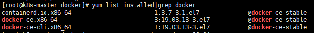
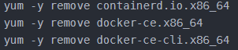
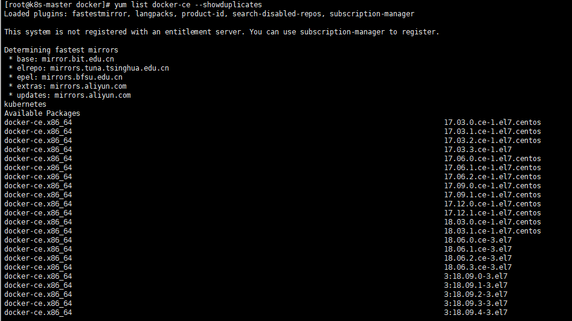
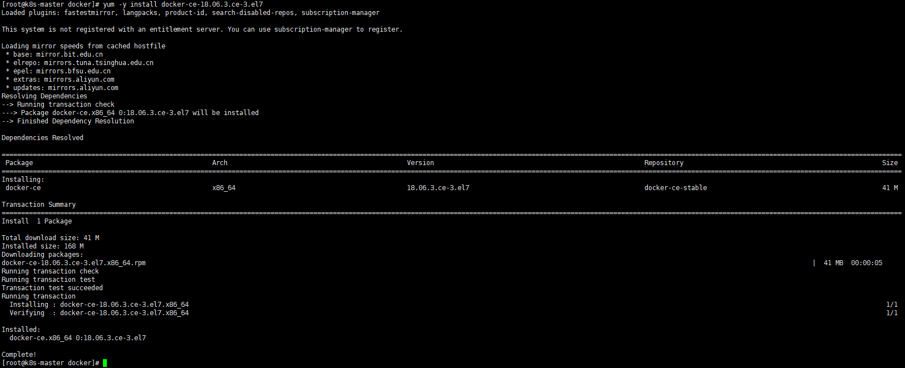

<h2center>docker安装elk
</h2>
# docker卸载
查看已安装的版本

	yum list installed|grep docker

卸载

	

查看可安装的版本

	yum list docker-ce --showduplicates
	

	查看内核版本
	uname -r
	
	把yum包更新到最新
	yum update
# docker安装elk
yum -y install docker-ce-18.06.3.ce-3.el7

	创建网络
	docker network create --subnet=172.18.0.0/16 elk
	
	镜像起别名
	docker tag imageid:version newImageName:version

	docker启动elasticsearch
	docker run -d --name=elasticsearch --net elk -p 21002:9200 --ip 172.18.0.2 -p 9300:9300 -v /data/elasticsearch.yml:/usr/share/elasticsearch/elasticsearch.yml docker.elastic.co/elasticsearch/elasticsearch:6.6.2
	如遇报错：max virtual memory areas vm.max_map_count [65530] is too low, increase to at least [262144]
	解决办法1：在/etc/sysctl.conf文件最后添加一行
				vm.max_map_count=262144
	解决办法2：执行命令：sysctl -w vm.max_map_count=262144
				查看结果：sysctl -a|grep vm.max_map_count
				
	设置宿主机可以访问虚拟机找那个的docker容器
	ROUTE -p add 172.18.0.0 mask 255.255.0.0 192.169.60.129
	
	往ES中导入json数据
	curl -XPOST '192.169.60.129:21002/std-2020-11-21/_doc/_bulk?pretty' --data-binary "@/home/dd/accounts.json"
	注意：std_2020-11-21是索引名称,_doc是type的名称

	docker启动kibana
	docker run -di --name=kibana --net elk -p 21003:5601 -v /etc/kibana/config:/usr/kibana/config kibana:6.6.2

	docker启动logstash
	docker run --name logstash --privileged=true --net=elk -p 8888:8888/udp -d -v /docker/logstash:/config-dir docker.elastic.co/logstash/logstash:6.4.2 -f /config-dir/logstash.conf
	docker run -d --name=logstash --net elk -v /data/logstash/config:/usr/logstash/config -v /etc/logstash/pipeline:/usr/logstash/pipeline logstash:6.6.2
	
	linux安装
	
	docker搭建nginx
	docker run -p 21004:80 --name nginx -d -v /data/nginx/images/:/home/images:ro -v /data/nginx/default.conf:/etc/nginx/default.conf:ro nginx
	docker容器安装vim编辑器
	apt-get update
	apt-get install vim
	
# filebeat采集系统信息

	启动filebeat: ./filebeat -e -c test.yml
test.yml配置
~~~
filebeat.inputs:
- type: stdin
  enabled: true
setup.template.settings:
  index.number_of_shards: 2
#output.console:
#  pretty: true
#  enabled: true
output.elasticsearch:
  hosts: ["192.169.60.129:21002"]
~~~
	filebeat采集docker日志
~~~
filebeat.inputs:
- type: docker
  containers.ids:
    - '*'
  processors:
    - add_docker_metadata: ~
output.elasticsearch:
  hosts: ["192.169.60.129:21002"]
~~~

# docker启动nginx
docker run -d --net elk -p 21005:80 --privileged --name nginx -v /data/nginx/html:/usr/share/nginx/html -v /data/nginx/conf/nginx.conf:/etc/nginx/nginx.conf -v /data/nginx/logs:/var/log/nginx -v /data/nginx/conf.d:/etc/nginx/conf.d -d nginx:release
docker run -d --net elk -p 21005:80 --privileged --name nginx -d nginx:release

~~~
java -javaagent:elastic-apm-agent-1.8.0.jar \
-Delastic.apm.service_name=test-java-application \
-Delastic.apm.server_url=http://localhost:8200 \
-Delastic.apm.secret_token= \
-Delastic.apm.application_packages=ourway.framework.boot \
-jar soundToText-Service-3.0-SNAPSHOT.jar 2>&1 &

java \
-javaagent:/home/meisw/elk/apache-skywalking-apm-bin/agent/skywalking-agent.jar \
-DSW_AGENT_COLLECTOR_BACKEND_SERVICES=127.0.0.1:11800 \
-DSW_AGENT_NAME=meisw-knife4j \
-jar meisw-knife4j-1.0.1.jar
~~~

# 修改elasticsearch索引的mapping

~~~
curl -XPUT localhost:9200/filebeat-6.6.2-2020.11.25/_doc/_mapping -d '  
{  
    "_doc": {  
        "properties": {  
            "created": {  
                "type":   "multi_field",  
                "fields": {  
                    "stream": { "type": "string" },  
                    "@timestamp":    { "type": "date"   } , 
					"prospector.type":{"type":"string"},
					"offset":{"type":"Number"},
					"message":{"type":"string"},
					"log.file.path":{"type":"string"},
					"input.type":{"type":"string"},
					"host.name":{"type":"string"},
					"docker.container.name":{"type":"string"},
					"docker.container.labels.org.label-schema.version":{"type":"string"},
					"docker.container.labels.org.label-schema.vendor":{"type":"string"},
					"docker.container.labels.org.label-schema.vcs-url":{"type":"string"},
					"docker.container.labels.org.label-schema.url":{"type":"string"},
					"docker.container.labels.org.label-schema.schema-version": { "type": "string" }, 
					"docker.container.labels.org.label-schema.name": { "type": "string" }, 
					"docker.container.labels.org.label-schema.license": { "type": "string" }, 
					"docker.container.labels.org.label-schema.build-date": { "type": "string" }, 
					"docker.container.labels.license": { "type": "string" }, 
					"docker.container.image": { "type": "string" }, 
					"docker.container.id": { "type": "string" },  
					"beat.version": { "type": "string" },  
					"beat.name": { "type": "string" },  
					"beat.hostname": { "type": "string" }
                }  
            }  
        }  
    }  
}  
~~~
# 删除ES某个索引下的所有数据

~~~
POST std-2020-11-21/_delete_by_query
{
	"query":{
		"match_all":{}
	}
}
~~~

# 索引相关操作

~~~
1.查看所有索引
GET /_cat/indices?v

2.创建索引
PUT /std-2020-11-21?pretty
{
	"settings": {
		"number_of_shards": 3,
		"number_of_replicas": 2
	},
	"mapping": {
		"_doc": {
			"properties": {
				"idcardno": {
					"type": "text"
				},
				"ganwei": {
					"type": "text"
				},
				"org2name": {
					"type": "text"
				},
				"@timestamp": {
					"type": "date"
				},
				"stafflevel": {
					"type": "text"
				},
				"actorno": {
					"type": "text"
				},
				"telnum": {
					"type": "keyword"
				},
				"usermail": {
					"type": "keyword"
				},
				"type": {
					"type": "text"
				},
				"@version": {
					"type": "text"
				},
				"tags": {
					"type": "text"
				},
				"loginname": {
					"type": "keyword"
				},
				"statename": {
					"type": "text"
				},
				"rzdate": {
					"type": "text"
				},
				"zyxuliename": {
					"type": "text"
				},
				"id": {
					"type": "long"
				},
				"staffsexname": {
					"type": "keyword"
				}
			}
		}
	}
}

3.创建数据
POST std-2020-11-21/
{"idcardno":"0000000000000",
"ganwei":"中级软件工程师",
"org2name":null,
"@timestamp":"2020-12-01T13:45:10.509Z",
"stafflevel":"03",
"actorno":"019051",
"telnum":"22222222222",
"usermail":"1111111@yusys.com.cn",
"type":"log",
"@version":"1",
"tags":["_dateparsefailure"],
"loginname":"1111111",
"statename":"离职员工",
"rzdate":"2016-10-24",
"zyxuliename":"软件序列",
"actorname":"111111",
"id":9726,
"staffsexname":"女"}

2.创建索引
PUT /network-2020-12-02?pretty
{
	"settings": {
		"number_of_shards": 3,
		"number_of_replicas": 2
	},
	"mapping": {
		"_doc": {
			"properties": {
				"id": {
					"type": "long"
				},
				"agreement": {
					"type": "text"
				},
				"local_address": {
					"type": "text"
				},
				"@timestamp": {
					"type": "date"
				},
				"external_address": {
					"type": "text"
				},
				"state": {
					"type": "text"
				},
				"pid": {
					"type": "keyword"
				},
				"local_poart": {
					"type": "text"
				},
				"external_port": {
					"type": "text"
				},
				"region": {
					"type": "text"
				},
				"company": {
					"type": "text"
				},
				"create_time": {
					"type": "keyword"
				},
				"flag": {
					"type": "text"
				}
			}
		}
	}
}

input {
    stdin {
    
    }
   jdbc{
   type => "tb_goodstest01"
    #jdbc sql server 驱动
    jdbc_driver_library => "D:/es/logstash-6.2.2/bin/bin/sqljdbc4-4.0.jar"
    #jdbc class 不同数据库有不同的 class 配置
    jdbc_driver_class => "com.microsoft.sqlserver.jdbc.SQLServerDriver"
    #配置数据库连接 ip 和端口，以及数据库    
    jdbc_connection_string => "jdbc:sqlserver://127.0.0.1:1433;databaseName=test01"
    #配置数据库用户名
    jdbc_user => "sa"
    #配置数据库密码
    jdbc_password => "123456"
    
    # 定时器 多久执行一次SQL，默认是一分钟
    # schedule => 分 时 天 月 年  
    # schedule => * 22  *  *  * 表示每天22点执行一次

    schedule => "* * * * *"
    #是否清除 last_run_metadata_path 的记录,如果为true那么每次都相当于从头开始查询所有的数据库记录
    clean_run => false
    #是否需要记录某个column 的值,如果 record_last_run 为真,可以自定义我们需要表的字段名称，
    #此时该参数就要为 true. 否则默认 track 的是 timestamp 的值.
    use_column_value => true
    #如果 use_column_value 为真,需配置此参数. 这个参数就是数据库给出的一个字段名称。当然该字段必须是递增的 可以是id 或者时间列(作用这个就是做为一个标识当下次执行同步操作的时候 根据这个列中的数据查起 )
    tracking_column =>  goods_id
    #是否记录上次执行同步操作数据结果 true表示记录上次操作到的位置  就是将tracking_column 中的数据写入到last_run_metadata_path 文件中
    record_last_run => true
    #这个文件需要自己创建出来 作用就是记录tracking_column(数据库中自增的列) 作为一个标识 下次执行同步数据库的操作的时候直接从这个标识查起  名字无所谓什么都是可以的
    last_run_metadata_path => "D:\es\logstash-6.2.2\bin\tb_goodstest01.txt"
    #是否将字段名称转小写。
    #这里有个小的提示，如果你这前就处理过一次数据，并且在Kibana中有对应的搜索需求的话，还是改为true，
    #因为默认是true，并且Kibana是大小写区分的。准确的说应该是ES大小写区分
    lowercase_column_names => false
    #你的SQL文件的位置，当然，你的SQL也可以直接写在这里。
    statement_filepath => "jdbc.sql"
    
    }
   jdbc{
    type => "tb_usertest02"

    jdbc_driver_library => "D:/es/logstash-6.2.2/bin/bin/sqljdbc4-4.0.jar"

    jdbc_driver_class => "com.microsoft.sqlserver.jdbc.SQLServerDriver"

    jdbc_connection_string => "jdbc:sqlserver://127.0.0.1:1433;databaseName=test02"

    jdbc_user => "sa"

    jdbc_password => "123456"
    

    schedule => "* * * * *"

    clean_run => true

    use_column_value => true

    tracking_column =>  userid

    record_last_run => true
 
    last_run_metadata_path => "D:\es\logstash-6.2.2\bin\tb_usertest02.txt"
   
    lowercase_column_names => false
   
    statement_filepath => "jbdctest02.sql"

    }
    
}
#在数据库导入到es中的数据的时候 es会自动创建出一些字段就是下面的这几个字段  要是不想要这几个字段就添加过滤器
filter { 
         mutate { 
             remove_field => ["@timestamp","@version","create_time","update_time"]
         }
    }

output {
 if[type]=="tb_goodstest01"{
    elasticsearch {
        # ES的IP地址及端口
        hosts => ["127.0.0.1:9200"]
        # 索引名称 可自定义
        index => "tb_goods_test01x"
        # 需要关联的数据库中有有一个id字段，对应类型中的id
        document_id => "%{goods_id}"
         "document_type" => "%{type}"

      }
    }
if[type]=="tb_usertest02"{
    elasticsearch {
      
        hosts => ["127.0.0.1:9200"]
     
        index => "tb_goods_test02x"
      
        document_id => "%{userid}"
         "document_type" => "%{type}"
         
      }
    }
    stdout {
        # JSON格式输出
        codec => json_lines
    }
}
~~~