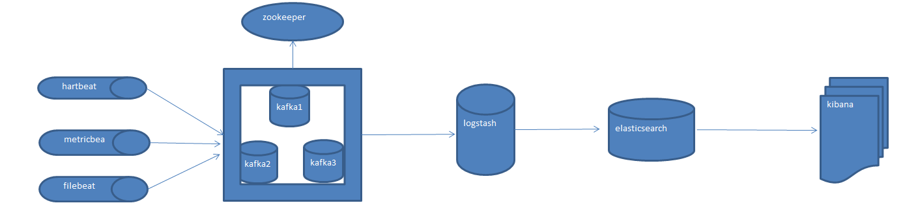
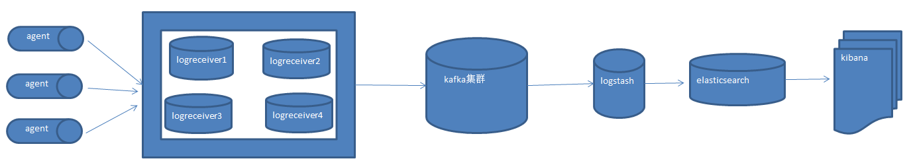

1.kafka需要依赖zookeeper使用了wurstmeister/kafka和wurstmeister/zookeeper这两个版本的镜像

　　1、docker pull wurstmeister/zookeeper  

　　2、docker pull wurstmeister/kafka
2.启动zookeeper

　　1.docker run -it --name  zookeeper  -p 2181:2181 -d wurstmeister/zookeeper

3.启动kafka命令

　　1.docker run -d   --name kafka -p 9092:9092 -e KAFKA_BROKER_ID=1 -e KAFKA_auto_create_topics_enable=true  -e KAFKA_HEAP_OPTS="-Xmx256M -Xms128M" -e 　　　　KAFKA_ZOOKEEPER_CONNECT=公网ip:2181 -e KAFKA_ADVERTISED_LISTENERS=PLAINTEXT://公网ip:9092 -e KAFKA_LISTENERS=PLAINTEXT://0.0.0.0:9092 -t wurstmeister/kafka 

　　/配置分组id

　　KAFKA_BROKER_ID=1

　　//开启自动创建主题(不然代码整合服务后启动报错,必须自己手动到服务上创建)

　　KAFKA_auto_create_topics_enable=true

　　//连接zookeeper

　　KAFKA_ZOOKEEPER_CONNECT=公网ip:2181

　　//默认内存1G自己服务器太小,调小一点不然启动报错内存溢出(此处也比较坑)

　　KAFKA_HEAP_OPTS="-Xmx256M -Xms128M"

　　//配置外网ip访问kafka

　　KAFKA_ADVERTISED_LISTENERS=PLAINTEXT://公网ip:9092

4.启动无法访问外网问题

　　1.进入hosts文件

　　　　vi /etc/hosts

　　　　//添加公网ip

　　　　公网ip

5.测试

　　进入kafka

　　docker exec it kafka /bin/bash

　　cd opt/kafka

　　创建主题

　　bin/kafka-topics.sh --create --zookeeper 公网ip:2181 --replication-factor 1 --partitions 1 --topic hello

　　查看主题列表：

　　bin/kafka-topics.sh --list --zookeeper 公网ip:2181　

　　运行一个消息生产者，指定topic为刚刚创建的主题:

　　bin/kafka-console-producer.sh --broker-list 公网ip:9092 --topic hello

　　创建kafka消费者(这是新版本创建消费者,老版本是使用zookeeper)

　　bin/kafka-console-consumer.sh --bootstrap-server公网ip:9092 --topic mykafka --from-beginning　

记录一下自己配置过程中踩得一些坑

# 测试案例

~~~
docker run -it --name zookeeper2 -p 2181:2181 -d wurstmeister/zookeeper

docker run -d --name kafka2 -p 9092:9092 -e KAFKA_BROKER_ID=1 \
-e KAFKA_auto_create_topics_enable=true -e KAFKA_HEAP_OPTS="-Xmx256M -Xms128M" \
-e KAFKA_ZOOKEEPER_CONNECT=192.169.60.129:2181 -e KAFKA_ADVERTISED_LISTENERS=PLAINTEXT://192.169.60.129:9092 \
-e KAFKA_LISTENERS=PLAINTEXT://0.0.0.0:9092 -t wurstmeister/kafka

创建主题
　　./bin/kafka-topics.sh --create --zookeeper 192.169.60.129:2181 --replication-factor 1 --partitions 1 --topic hello
查看主题列表：
　　./bin/kafka-topics.sh --list --zookeeper 192.169.60.129:2181　
运行一个消息生产者，指定topic为刚刚创建的主题:
　　./bin/kafka-console-producer.sh --broker-list 192.169.60.129:9092 --topic hello
创建kafka消费者(这是新版本创建消费者,老版本是使用zookeeper)
　　./bin/kafka-console-consumer.sh --bootstrap-server 192.169.60.129:9092 --topic hello --from-beginning
~~~

# docker搭建kafka集群
--net elk -p 21002:9200 --ip 172.23.0.2
~~~
docker run --name zk --net elk --ip 172.18.1.100 -p 12181:2181 -d wurstmeister/zookeeper:latest

docker run --net elk --ip 172.18.1.101 -p 19092:9092 --name kafka1 -d -e KAFKA_BROKER_ID=0 -e KAFKA_ZOOKEEPER_CONNECT=192.169.60.129:12181 -e KAFKA_ADVERTISED_LISTENERS=PLAINTEXT://192.169.60.129:19092 -e KAFKA_LISTENERS=PLAINTEXT://0.0.0.0:9092 wurstmeister/kafka:latest
docker run --net elk --ip 172.18.1.102 -p 19093:9093 --name kafka2 -d -e KAFKA_BROKER_ID=1 -e KAFKA_ZOOKEEPER_CONNECT=192.169.60.129:12181 -e KAFKA_ADVERTISED_LISTENERS=PLAINTEXT://192.169.60.129:19093 -e KAFKA_LISTENERS=PLAINTEXT://0.0.0.0:9093 wurstmeister/kafka:latest
docker run --net elk --ip 172.18.1.103 -p 19094:9094 --name kafka3 -d -e KAFKA_BROKER_ID=2 -e KAFKA_ZOOKEEPER_CONNECT=192.169.60.129:12181 -e KAFKA_ADVERTISED_LISTENERS=PLAINTEXT://192.169.60.129:19094 -e KAFKA_LISTENERS=PLAINTEXT://0.0.0.0:9094 wurstmeister/kafka:latest

docker exec -it kafka1 /bin/bash
cd /opt/kafka_2.13-2.6.0
其中，2.12为scala版本，2.4.1为kafka版本。
~~~
~~~
docker run -p 19092:9092 --name kafka1 -d -e KAFKA_BROKER_ID=0 -e KAFKA_ZOOKEEPER_CONNECT=宿主机ip:12181 -e KAFKA_ADVERTISED_LISTENERS=PLAINTEXT://宿主机ip:19092 -e KAFKA_LISTENERS=PLAINTEXT://0.0.0.0:9092 wurstmeister/kafka:latest
docker run -p 19093:9093 --name kafka2 -d -e KAFKA_BROKER_ID=1 -e KAFKA_ZOOKEEPER_CONNECT=宿主机ip:12181 -e KAFKA_ADVERTISED_LISTENERS=PLAINTEXT://宿主机ip:19093 -e KAFKA_LISTENERS=PLAINTEXT://0.0.0.0:9093 wurstmeister/kafka:latest
docker run -p 19094:9094 --name kafka3 -d -e KAFKA_BROKER_ID=2 -e KAFKA_ZOOKEEPER_CONNECT=宿主机ip:12181 -e KAFKA_ADVERTISED_LISTENERS=PLAINTEXT://宿主机ip:19094 -e KAFKA_LISTENERS=PLAINTEXT://0.0.0.0:9094 wurstmeister/kafka:latest
~~~
# docker搭建kafkaManager

~~~
1. 下载镜像
docker pull sheepkiller/kafka-manager
2. 启动容器
docker run -d --name kafka-manager --net elk --ip 172.18.1.104 -p 19095:9000 --env ZK_HOSTS=192.169.60.129:12181 -d sheepkiller/kafka-manager
3. 访问管理页面
http://192.169.60.129:19095/
4. 配置kafka
5. 进入kafka1
docker exec -it kafka1 /bin/bash
cd /opt/kafka_2.13-1.6.0
创建主题
　　./bin/kafka-topics.sh --create --zookeeper 192.169.60.129:12181 --replication-factor 1 --partitions 1 --topic hello
查看主题列表：
　　./bin/kafka-topics.sh --list --zookeeper 192.169.60.129:12181　
运行一个消息生产者，指定topic为刚刚创建的主题:
　　./bin/kafka-console-producer.sh --broker-list 192.169.60.129:19092 --topic hello
创建kafka消费者(这是新版本创建消费者,老版本是使用zookeeper)
　　./bin/kafka-console-consumer.sh --bootstrap-server 192.169.60.129:19093 --topic hello --from-beginning
~~~

# filebeat上送数据到kafka配置

~~~
filebeat.prospectors:
- type: log
  enabled: true
  paths:
    - /var/log/*.log
  fields_under_root: true
#正则匹配
  multiline.pattern: '^Hh'
#默认为false匹配pattern的行合并到上一行,true不匹配pattern的行合并到上一行
  multiline.negate: true
#after 或 before，合并到上一行的末尾或开头
  multiline.match: after
  fields:
    log_type: saas_auth
    namespace: rel
#    hostname: HY-REL-SAAS01
    log_topic: test
output.kafka:
  partition.round_robin:
    group_events: 1
    reachable_only: true
  enabled: true
  hosts: ["192.169.60.129:19092","192.169.60.129:19093","192.169.60.129:19094"]
  topic: 'test'
  compression_level: 9
  max_message_bytes: 10000000
  retry.max: 5
  timeout: 180
~~~
# logstash 消费kafka上送ES配置

~~~
input {
  kafka {
    topics => ["test"]
    type => "kafka"
    bootstrap_servers => "192.169.60.129:19092,192.169.60.129:19093,192.169.60.129:19094"
    codec => "json"
  }
}

output {
  elasticsearch {
    hosts => ["192.169.60.129:21002"]
    index => "logkafka-%{+YYYY-MM-dd}"
  }
}
~~~
# metricbeat 上送数据到kafa 配置

~~~
output.kafka:
  hosts: ["192.169.60.129:19092,192.169.60.129:19093,192.169.60.129:19094"]
  topic: 'test'
  partition.round_robin:
    reachable_only: false
  required_acks: 1
  max_message_bytes: 100000
  
启动metricbeat
./metricbeat &

metricbeat启用kafka

~~~
# 请欣赏图片

