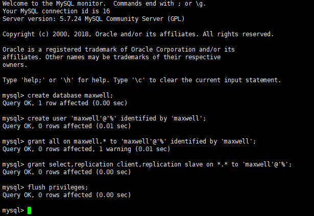

<h1>
docker安装mysql
</h1>

# docker搜索mysql镜像

~~~
docker search mysql
~~~
# docker下载mysql镜像

~~~
docker pull docker.io/mysql
~~~
# docker 启动mysql镜像

~~~
docker run -d --name=mysql --net elk --ip 172.18.0.8 -p 21008:3306 -e MYSQL_ROOT_PASSWORD=123456 docker.io/mysql:latest

GRANT ALL PRIVILEGES ON *.* TO root@'%'  IDENTIFIED BY '123456'  WITH GRANT OPTION;

docker run -d --name=mysql --net elk --ip 172.18.0.9 -p 21009:3306 -e MYSQL_ROOT_PASSWORD=123456 mysql:5.7
 
~~~

# 创建maxwell用户和密码

# docker安装kafka
	1.前置条件：先安装zookeeper

~~~
docker run -d --net elk --ip 172.18.0.10 --name zookeeper -p 2181:2181 -v /etc/localtime:/etc/localtime wurstmeister/zookeeper

进入zookeeper容器
docker exec -it zookeeper /bin/bash
启动zookeeper
 ./zkCli.sh -server 192.169.60.128:21010
~~~
	2.安装kafka

~~~
docker run  -d --net elk --ip 172.18.0.11 --name kafka -p 21010:9092 -e KAFKA_BROKER_ID=0 -e KAFKA_ZOOKEEPER_CONNECT=172.18.0.10:2181 -e KAFKA_ADVERTISED_LISTENERS=PLAINTEXT://172.18.0.11:9092 -e KAFKA_LISTENERS=PLAINTEXT://0.0.0.0:9092 -t wurstmeister/kafka

1.进入容器
docker exec -it kafka /bin/sh

2.进入路径
cd /opt/kafka_2.11-2.0.0/bin

3.运行kafka生产者发送消息
./kafka-console-producer.sh --broker-list 192.169.60.129:21010 --topic sun

4. 发送消息
{"datas":[{"channel":"","metric":"temperature","producer":"ijinus","sn":"IJA0101-00002245","time":"1543207156000","value":"80"}],"ver":"1.0"}

5. maxwell 以stdout producer方式启动
bin/maxwell --user='maxwell' --password='maxwell' --host='192.169.60.129' --producer=stdout
~~~

# kafka相关操作
	创建topic
	
~~~
bin/kafka-topics.sh --create --topic test0 --zookeeper 192.169.60.129:21010 --config max.message.bytes=12800000 --config flush.messages=1 --partitions 5 --replication-factor 1
~~~
	查看当前kafka集群中的topic的情况

~~~
bin/kafka-topics.sh --list --zookeeper 192.169.60.129:21010
~~~
